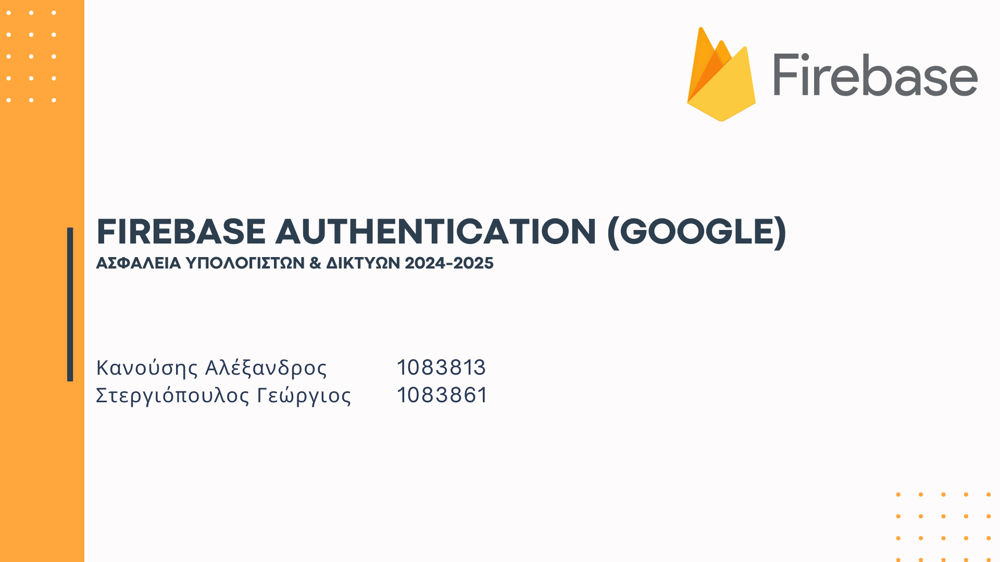
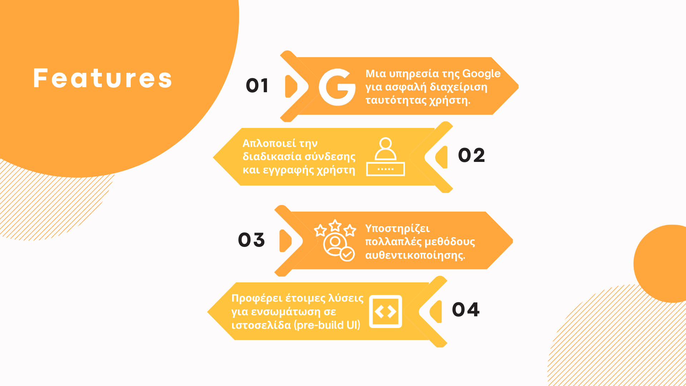
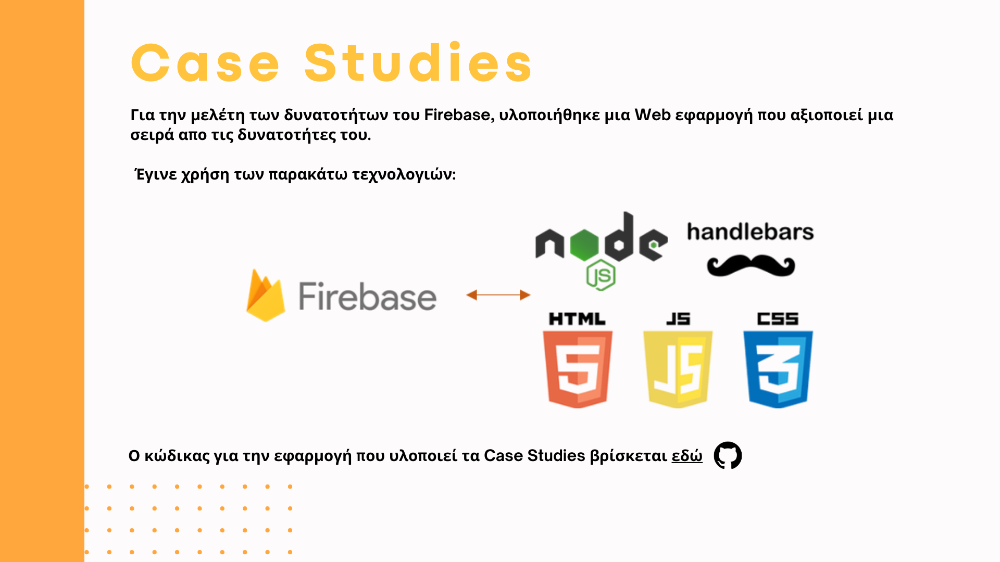
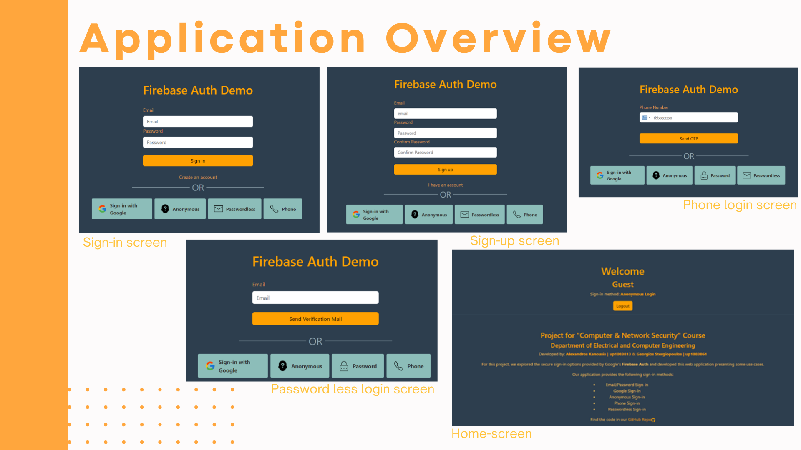
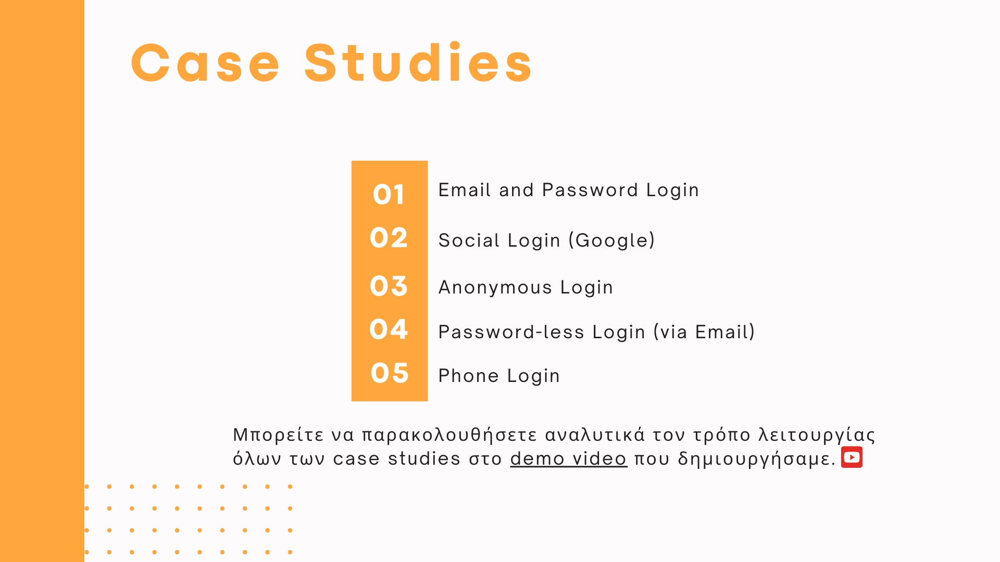
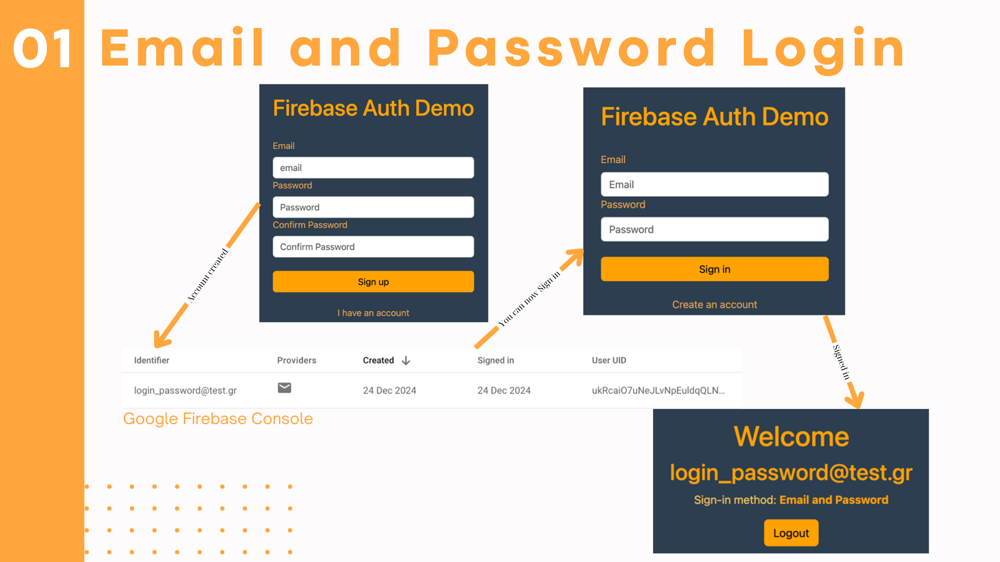
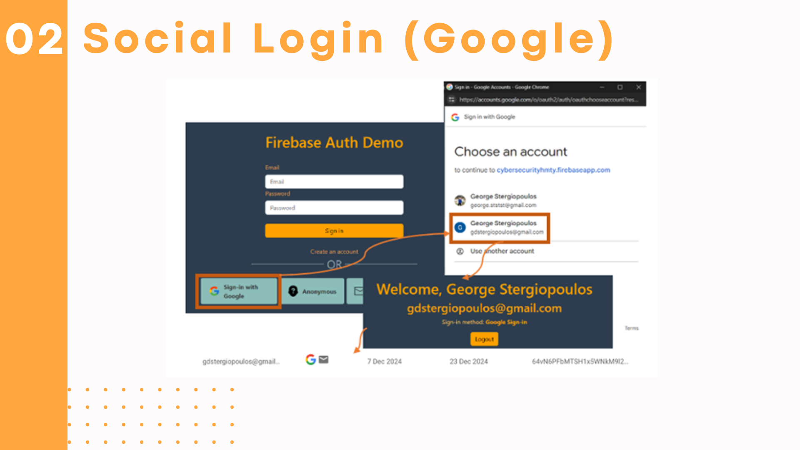
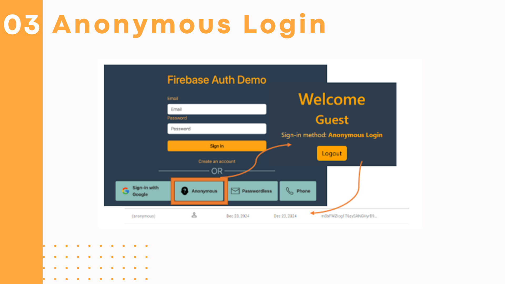
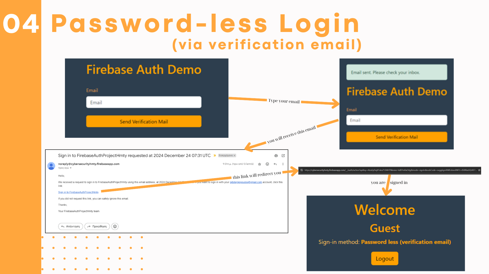
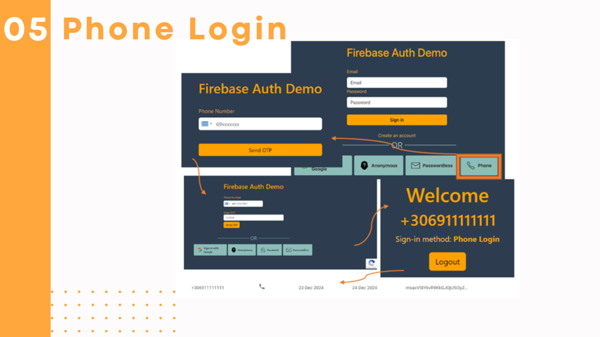

<h1>Project for Computer & Network Security Course</h1>
<h2>Explore the abilities of Google's Firebase Auth Service and create a web application demonstrating some of them</h2>

<a href="https://www.youtube.com/watch?v=JdAe3T6hp6E">Watch a Demo Video</a> | <a href="report.pdf">Read the report</a> | <a href="presentation.pdf">See our presentation </a> 
  
Developed by: 
<strong>Kanousis Alexandros</strong> 
<strong>Stergiopoulos Georgios</strong>

<h3>Οδηγίες Εγκατάστασης</h3>
<ol>
  <li>Βεβαιωθείτε ότι ο υπολογιστής σας έχει εγκατεστημένη την NodeJS ή εγκαταστήστε την από εδώ.</li>
  <li>Κατεβάστε τον κώδικα από το Github ή εκτελέστε την εντολή</li>
  <i>git clone http://github.com/gdstergiopoulos/FirebaseAuthProject</i>
  <li>Εκτελέστε (έχοντας βεβαιωθεί ότι το terminal σας βρίσκεται στο path όπου βρίσκεται ο κώδικας), τις παρακάτω εντολές</li>
  <i>npm install npm start</i>
  <li>Δοκιμάστε την εφαρμογή μας στο http://localhost:3000/</li>
</ol>

