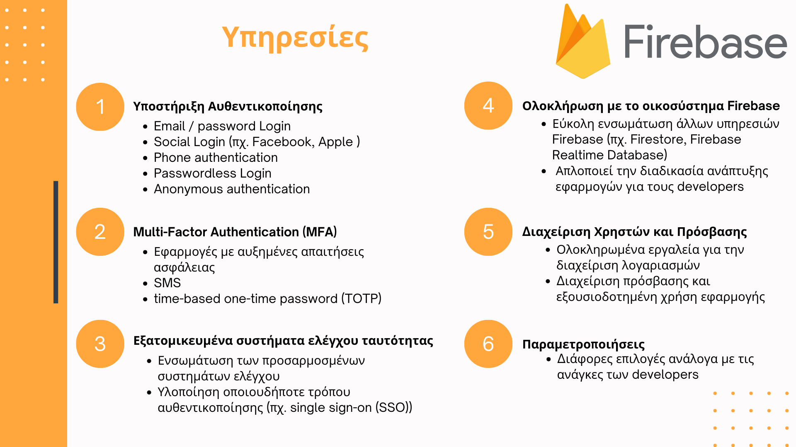

<h1>Project for Computer & Network Security Course</h1> 
<h2>Explore the abilities of Google's Firebase Auth Service and create a web application demonstrating some of them</h2>

<a href="https://www.youtube.com/watch?v=JdAe3T6hp6E">Watch a Demo Video</a> | <a href="report.pdf">Read the report</a> | <a href="presentation.pdf">See our presentation </a> 
  
Developed by: 
<strong>Kanousis Alexandros</strong> 
<strong>Stergiopoulos Georgios</strong>

